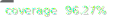

# WebCryptoWrapper



英語版READMEは [README_en.md](./README_en.md) を参照してください。

WebCryptoWrapper は、ブラウザの **Web Crypto API** と Node.js の `crypto.webcrypto` を
統一的に扱える軽量ラッパーです。暗号アルゴリズムの呼び出し方法や入出力を
[crypto-js](https://github.com/brix/crypto-js) 互換に揃えているため、既存の
CryptoJS ベースのコードをほぼそのまま流用できます。

AES 暗号化ではパスフレーズを用いた場合に "Salted__" から始まる CryptoJS 形式の
文字列を返し、16〜32 バイトの鍵を直接指定した場合には IV を暗号文の前に付加した
文字列が返されるため、復号時に IV を別途渡す必要はありません。

## インストール

```bash
npm install webcryptowrapper
```

ブラウザで利用する場合は `index.js` をスクリプトとして読み込むだけで
`window.CryptoWeb` として使用できます。

```html
<!-- example -->
<script src="./node_modules/webcryptowrapper/src/index.js"></script>
<script>
  (async () => {
    const enc = await CryptoWeb.AES.encrypt('hello', 'secret key 123');
    console.log(enc.toString());
  })();
</script>
```

## 使い方

```javascript
// Node.js
const CryptoWeb = require('./index');

// Browser (after loading index.js via <script>):
// const CryptoWeb = window.CryptoWeb;

(async () => {
  // PBKDF2
  const key = await CryptoWeb.PBKDF2('password', 'salt', { keySize: 8, iterations: 1000 });

  // AES 暗号化（IV は自動生成）
  const enc = await CryptoWeb.AES.encrypt('hello', key);
  console.log(enc.toString());

  // AES 復号
  const dec = await CryptoWeb.AES.decrypt(enc.toString(), key);
  console.log(dec.toString());

  // パスフレーズで AES 暗号化
  const pwEnc = await CryptoWeb.AES.encrypt('hello', 'secret key 123');
  console.log(pwEnc.toString()); // CryptoJS と同じ値
  const pwDec = await CryptoWeb.AES.decrypt(pwEnc.toString(), 'secret key 123');
  console.log(pwDec.toString());

  // SHA-256 など各種ハッシュ
  const hash = await CryptoWeb.SHA256('message');
  console.log(hash.toString());
  const md5 = await CryptoWeb.MD5('message');
  console.log(md5.toString());
})();
```

## API

- `enc.Utf8`, `enc.Hex`, `enc.Base64` — CryptoJS と同じインターフェースのエンコードユーティリティ
- `PBKDF2(password, salt, options)` — WebCrypto の PBKDF2 を使った鍵導出
- `AES.encrypt(data, key, options)` — AES-CBC による暗号化
- `AES.decrypt(ciphertext, key, options)` — AES-CBC による復号
- `SHA1(data)`, `SHA256(data)`, `SHA384(data)`, `SHA512(data)` — 各種 SHA ハッシュ計算
- `MD5(data)` — MD5 ハッシュ計算

各関数は Promise を返し、戻り値は `toString()` メソッドを持つ CryptoJS 互換の
オブジェクトです。

## テスト

リポジトリには簡単な動作確認用テストが含まれています。依存モジュールを
インストール後、次のコマンドで実行できます。

```bash
npm install
npm test
```

## ライセンス

[ISC License](./LICENSE) の下で公開されています。
